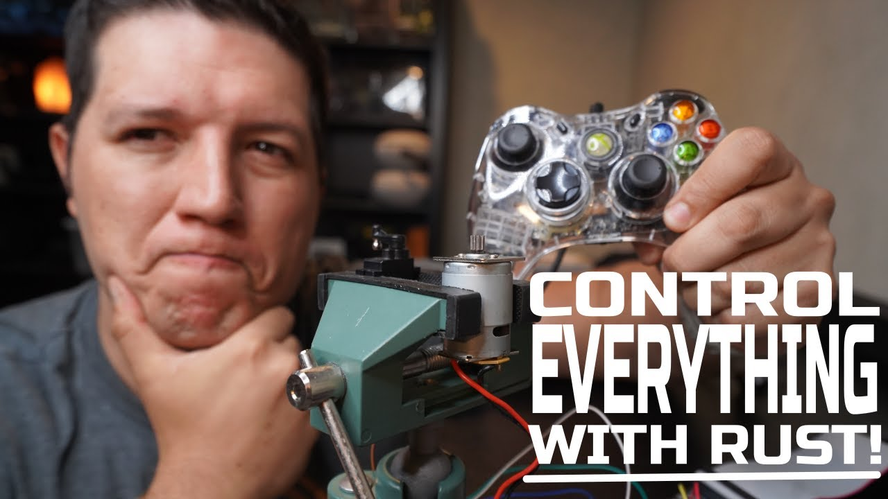

# Embedded Rust

  

Welcome to the **Embedded Rust** repository! This collection showcases exciting and innovative Rust projects designed to push the boundaries and inspire your creativity.

## 🚀 Projects Overview
Dive into a variety of Rust projects, each crafted to teach, challenge, and motivate you to explore the full potential of Rust programming. From controlling hardware to optimizing performance, these projects cover a broad spectrum of applications.

## 🌟 Get Inspired!
Check out our [YouTube playlist](https://www.youtube.com/playlist?list=PLxM2CWwQlzBu9-UHsaxnQpc0YweGwKwn3) for detailed walkthroughs, tutorials, and behind-the-scenes insights into each project. Subscribe and follow along as we dive deep into the world of Rust programming.

## 📂 Project List
- **Accelerometer Control at 100Hz**: Learn how to broadcast accelerometer data using UDP.
- **3D Vehicle Simulation**: Create a proof of concept for a 3D vehicle driving down the road.
- **Xbox Controller Integration**: Control an Xbox controller with Rust.
- **Motor Speed Control**: Explore the differences between PWM and reducers for DC motor control.
- **Fast Developer Workflows**: Enhance your coding efficiency with touch typing, local testing, and version control.

## 📧 Get Involved
Feel free to contribute, ask questions, or share your own projects inspired by Rust. Let's build an inspiring Rust community together!

Stay inspired and keep coding! 🚀

---

*Made with ❤️ by Rust enthusiasts*
